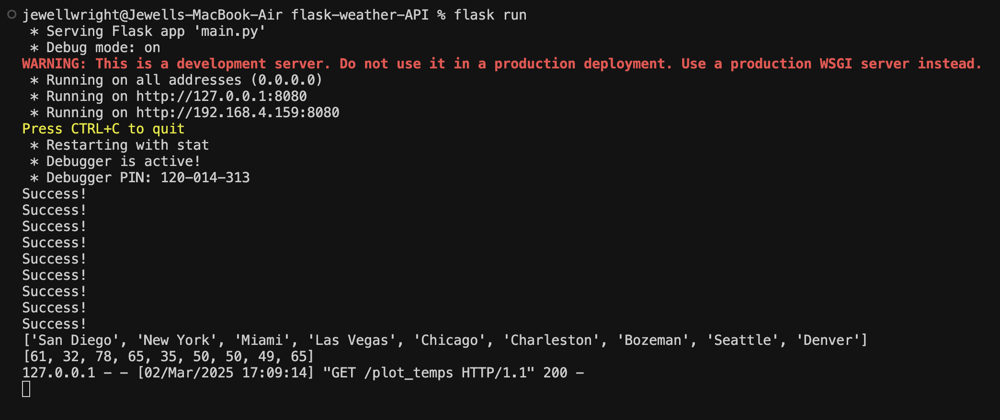

# Flask Weather App

## Overview
This is a Flask-based application that retrieves weather data using the OpenWeatherMap API.

## Requirements
Ensure you have the following installed:
- The application must be deployed on your GCP VM.

---

## Exercise 1
### Using the OpenWeatherMap API

1. **Obtain an API key** 
    -> Go to [OpenWeatherMap](https://openweathermap.org/price) and get an API key.
2. **Test your API key**
    -> You should validate that the API key is working correctly by entering the following URL in a browser with YOUR_API_KEY replaced with your actual API key:

   ```
   http://api.openweathermap.org/data/2.5/weather?q=london&appid=YOUR_API_KEY
   ```
3. **Start your virtual machine**
    -> Go to your GCP dashboard and navigate to your virtual machine instance and start it.
4. **Clone the source code to this repo**
    -> SSH into your virtual machine and clone the current repo onto the machine. Be sure to this in a safe location on the machine and not within another repository. Last, cd into the repo directory from the VM.
5. **Add your API key to the source code**
    -> There are placeholders within functions for these routes in the main.py within the repo:
    - temperature(city)
    - read_temps()

        Update the '*******************' placeholders with your API key using vim or micro. Save/Commit/Push your changes.
6. **Validate everything works**
    -> After making the necessary code updates, start the flask application.
    ```bash
    flask run
    ```
### Breakdown of Repo Files: 
- `main.py` The core Flask application that handles API requests and responses.
- `templates/` Contains the HTML files used for rendering web pages.
- `.flaskenv` Stores the environment variables that act as the configuration settings for the Flask application.

### Screenshot Examples:




---

## Exercise 2
### Linux Command Line
Update this README file directly with the corresponding command for each question. Assume the top-level directory is `/home/activity2`, which contains two subdirectories: `proj1` and `proj2`. Show the command to achieve each of the following:

1. **Copy all `.py` files from `proj1` to `proj2` (keeping file names unchanged):**
2. **Copy all `.py` files from `proj1` to the top-level directory (keeping file names unchanged):**
3. **Copy `p1.txt` from `proj1` to `proj2` as `p1_new.txt` (from top-level directory):**
4. **Create a subdirectory `proj3` under the top-level directory and copy all contents of `proj1` to it:**
5. **Run `p1.py` Flask application in the background and keep it running after disconnecting from the terminal:**

---

## Submission Guidelines

For Exercises 1 and 2:
- Be sure to submit the 3 screenshots specified for Exercise 1 on Blackboard.
- Include answers for Exercise 2 in this file.

Happy coding! 🚀